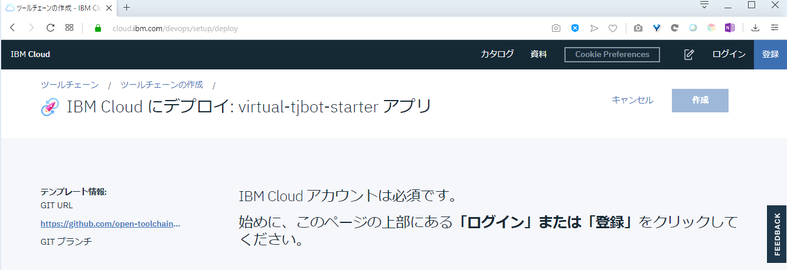
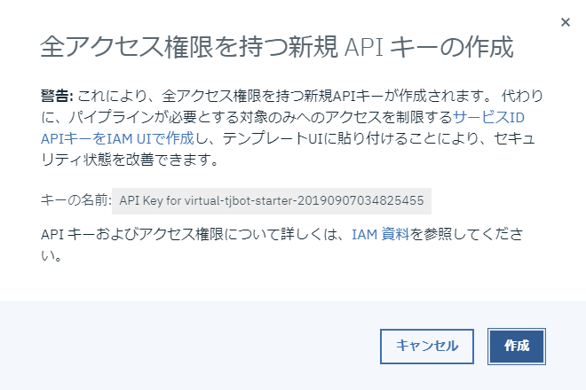
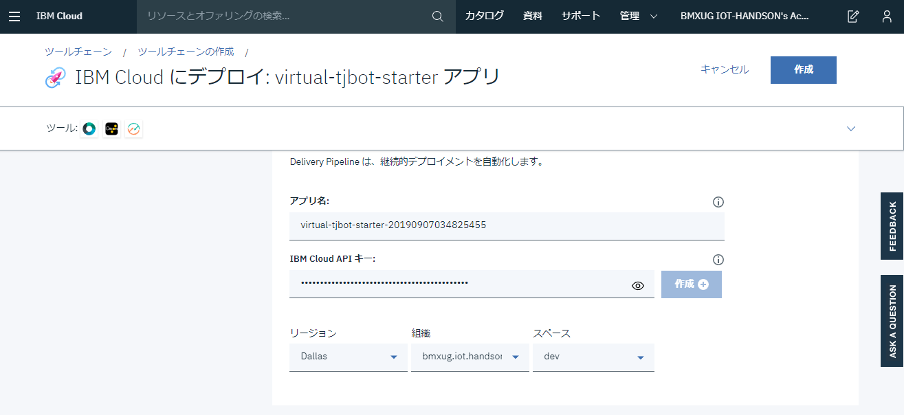
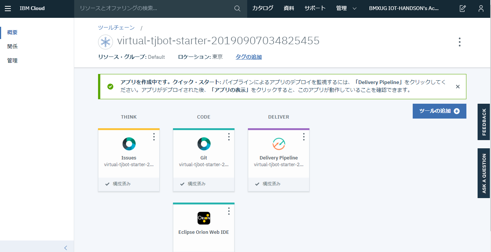
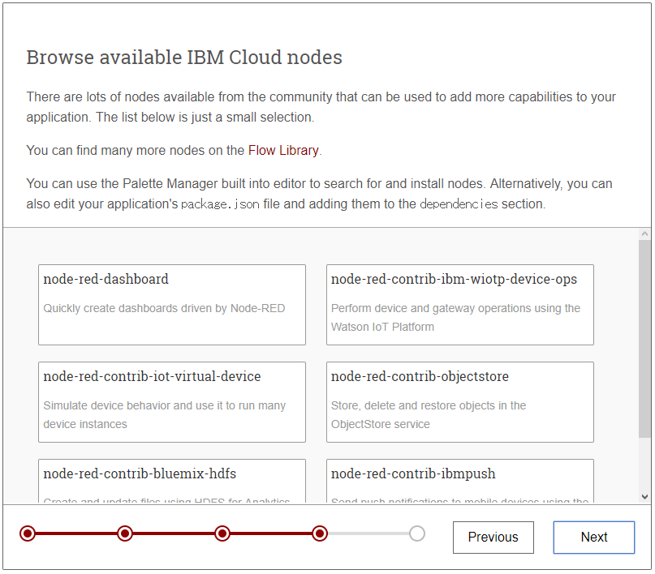
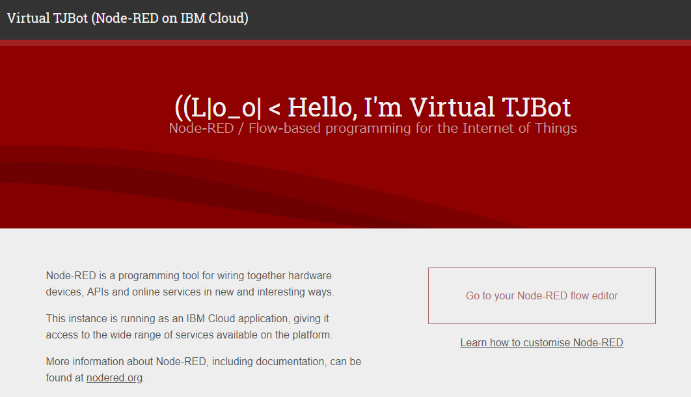
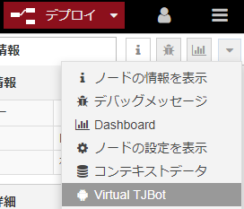

# Hello, Virtual TJBot

BMXUG TJBotFan

IBM Champion

Shoichiro Sakaigawa /  @l_s_s_l

---

## Whoami

IBMChampion Cloud 2018-2019

Pumpkin Heads株式会社代表取締役

著書：

コンテナ・オーケストレーション（共著 IBM Kubernetes Service章、翔泳社）

---

## Whoami

寄稿：

月刊I/O 2019年3月号

「＜Node-RED＞　「AWS IoT ボタン」を用いて「お知らせ機能」を作る」

@IT IBMChampion連載記事

「もっとスケーラブルなWordPress実装をKubernetesクラスター上にデプロイする」

https://www.atmarkit.co.jp/ait/articles/1905/19/news002.html

---

### IBM Champion?

IBMのUS本社が世界で活躍するエンジニアの活動実績を表彰・認定する制度
コミュニティ活動、登壇、執筆などの実績を申請することで獲得することができます。

受賞後はIBMの公式外部エヴァンジェリストとして活動を行う事ができます。

受賞者限定グッズやイベント優待などもあります。

---

# What's Node-RED

IBM英国Hursley研究所のメンバーを中心に開発された、ハードウェアデバイス、API、オンラインサービスを連携させることができる開発用ツールです。

ブラウザベースのエディタから多種多様なノードを結びつけて容易にフローを作成できます。

---

# 用語解説

---

### ノード

予め機能が登録された部品。

自分でこのノードをNode.jsを始めプログラミングして、公開することも可能。

---

### フロー

プログラムの流れを「フロー」として「フローエディタ」と呼ばれる編集画面に
使いたい部品（ノード）を並べて、線で結ぶことでプログラムを作ることができます。

---

# What's Virtual TJBot

物理のTJBotを手に入れる前に試したい・実機ハンズオンでTJBotは無いけど同等のコマンドが試せないかということで
Node-REDのフローエディタ上で動作するVirtual TJBotを紹介します。

---

このプレゼンテーションでは、Node-REDの構築からVirtual TJBotの設定までを自動的に行うことができる`Virutal-TJBot-Starter`というパッケージを利用します。

### https://bit.ly/virtualTJBot

---

## どうやって動いているの？

Virtual TJBotは、Node-REDのVirutal TJBotノードを利用して稼働しています。

ここで紹介するのはIBM Cloud上のCloud Foundry Node.jsサービスを利用したNode-REDのプラットフォーム上へ自動設定を行う方法です。

この設定自動化によりどなたでもかんたんにハンズオン同等の環境を構築することが可能となります。

---

## 前提条件

- IBM Cloudライトアカウントもしくはそれ以上が必要
- 過去にNode-REDをIBM Cloudで立ち上げたことが無いこと
    - このハンズオン中に過去Node-REDを動かしたことがある方は個別にご相談ください
- PCからアクセスすること
    - 設定完了後はお好きなNode-REDのフローエディタが動けばどこでも問題ありません

---

## 設定方法

１. Virtual TJBot Starter Applicationのページへアクセスする

https://bit.ly/virtualTJBot

---

２． `Deploy to IBM Cloud`ボタンをクリックする

３． IBM Cloudへログインしていない場合はここでログインを行う

---

４． IBM Cloudへのセットアップ画面になります。
ツールチェーン名などは、今回デフォルトのまま進みます。

---

※Note：
ツールチェーンとは、gitやDelivery Pipelineという設定自動化を行うCI/CDツールが動くようセットアップされるグループをさします。
IBM Cloudツールチェーンは、DevOps項目から利用ができ、PaaS環境のセットアップやkubernetes環境へのアプリケーション配布などができる仕組みです。

---

５． 必須設定項目の`Delivery Pipeline`をクリックします。

６． `IBM Cloud APIキー：`と書かれた項目が現在空欄となっています。
この項目はみなさんのIBM Cloudカウントそれぞれに紐づく内容のため、
`作成`ボタンをクリックして生成します。

---

７． APIキーを新規作成するにあたり警告が表示されます。
この手順ではクラウドのサービスを自動的に作成する権限を持つAPIキー（合言葉）を作成・登録することになります。
細かくこの合言葉に対して許可する範囲をIAMという機能で設定が可能です。
今回は自動的にIBM Cloudのサービスを一部作成するため、
このまま`作成`をクリックします。

---

８． `IBM Cloud APIキー:`の項目、`リージョン`、`組織`、`スペース`が埋まったことを確認して、画面上部の`作成`をクリックします

---

９．これでVirtual TJBotを起動する準備ができました。
画面中央の`Delivery Pipeline`をクリックして完了状態を確認しましょう。

---

## 失敗してしまった

---

１０． 失敗してしまう場合は・・・

Deployの項目にある再生ボタンをクリックします。

---

※失敗する理由：

さまざまな理由が考えられますが、IBM Cloud内での処理プロセスのなかでタイムアウトなどが起こりエラーが発生する場合があります。３回ほど試しても進まない場合は、スタッフへご相談ください

---

１１． 設定の完了
Deployの項目が緑になり、`ステージは成功`となったら完了です。

１２． ブラウザの戻るボタンで戻り、画面上部の`アプリURLにアクセス`をクリックします。

---

１３． Node-REDの初期ウィザードが表示されます。`Next`をクリックします。

---

１４． Node-REDのフローエディタをアクセスする際に必要なUsernameとPasswordを決めて、`Next`をクリックします。 
※チェックボックスにチェックを入れると、フローエディタを読み取り専用で開くことができるようになります。

---

１５． `Next`をクリックします

ここでは詳細を説明しませんが、アプリケーション稼働状況（CPU/メモリなど）を表示する場合はURLを控えてチェックをオンにします。

---

１６． IBM CloudとNode-REDを組み合わせて使うにあたり便利なNodeの紹介です。
ここでは何もせず`Next`をクリックします

---

１７． `Finish`をクリックしてインストールの完了です。

---

## 操作編

---

１． 設定作業が完了すると、ログイン手前の画面が表示されます。
この画面がログインURLになるので、適宜ブックマークなどしておくと良いでしょう。
`Go to your Node-RED flow editor`ボタンをクリックして進みます。

---

２．設定編で設定したUsernameとPasswordを入力して`ログイン`をクリックします。

---

３．フローエディタが表示されます。

---

４．Virtual TJBotのパネルを開きます。
画面右上の▼記号をクリックして、Virtual TJBotをクリックします。

---

５．Sampleタブの`(2) Blink LED`のフローが自動で起動して、色が順番に変わっていきます。

---

## Virtual TJBotと物理のTJBotとの違い

ここまででVirtual TJBotの起動について紹介しました。

TJBotFanのハンズオンで使用されているNode-REDフローが、
Virtual TJBot版に移植されています。

ここでは、物理のTJBotで実現していたものを、
Virtual TJBotではどのように置き換えをしているのか差分を紹介します。

---

### ハンズオンフローの対比表

|物理版|VirtualTJBot|
|:--|:--|
|IPアドレスをしゃべる|廃止|
|カメラで人物判定|opencv機能から、Watson VisualRecognitionに変更|

---

### ノードの対比表

| 物理版               | VirtualTJBot                                   |
|:---------------------|:-----------------------------------------------|
| take photo node | see ノードを組み合わせたフローに変更(ブラウザからWebカメラを使用)         |
| control led(GPIO)     | shine ノードに変更（Virtual TJBotタブで頭が光る) |
| control arm(GPIO)| waveノードに変更（Virtual TJBotタブで手を振る）|
| open jtalk | Play audioに変更(端末OSの音声合成機能に依存) |

---

## ここまででVirtual TJBotのセットアップと說明は終了です。

## おうちでもぜひTJBotと遊んでみてください

---

## 告知1

### TJBotFANグループ：

### https://tjbotfan.tokyo

Facebook / Twitterなども↑から

---

## 告知2

### 技術書典7 に出店します（し23D）

#### 基礎編：TJBot組立から操作まで
#### 応用編：TJBotのカスタマイズ

---

## Thanks!   have a fun TJBot!!

